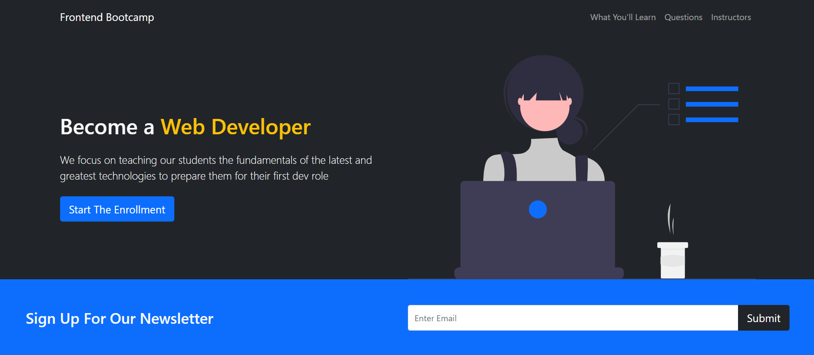
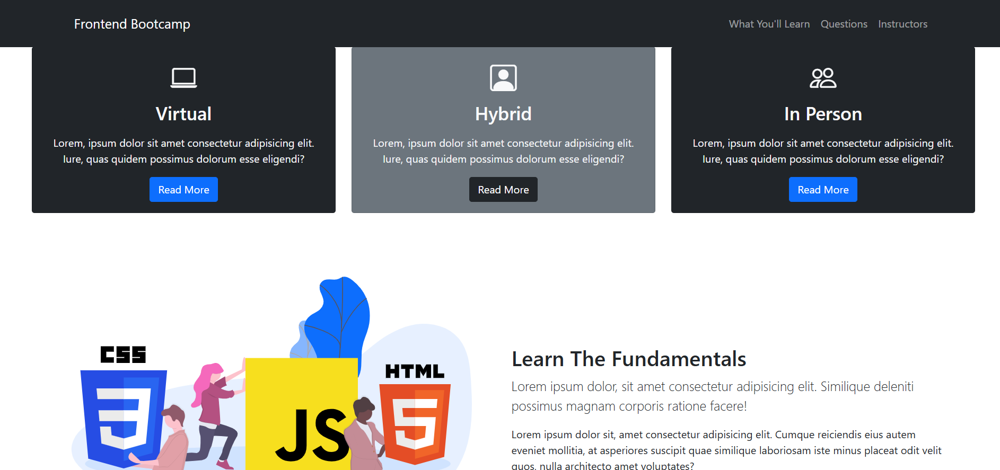
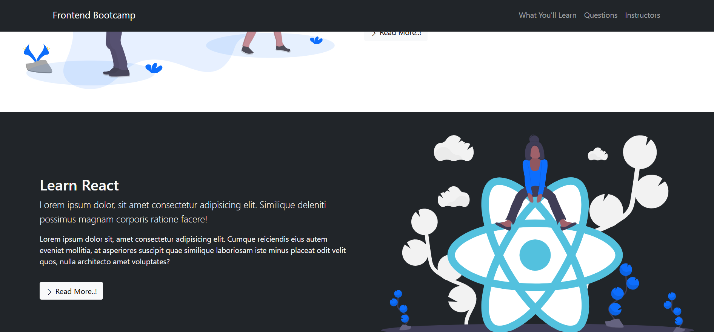
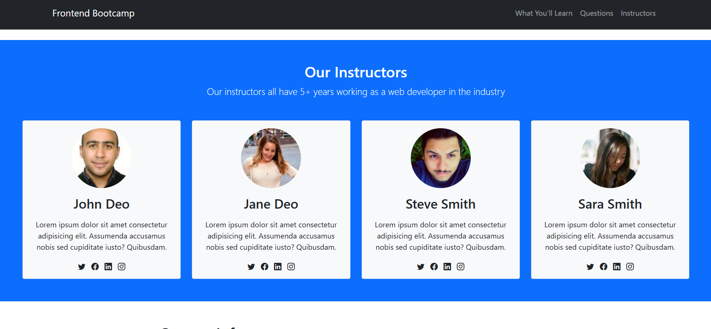
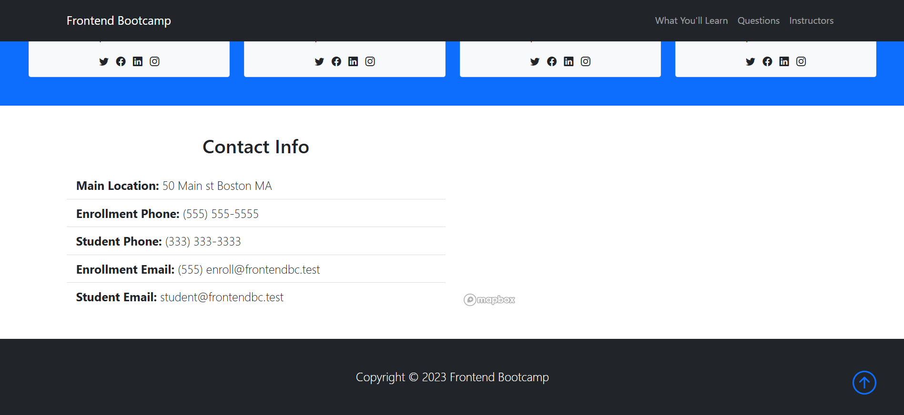

# 🌐 Bootstrap-5-Website – Modern Responsive Web Design

A sleek and fully responsive **website** built using **Bootstrap 5**, offering a clean and modern UI.


## 🚀 Features

- 🎨 **Modern UI** – Built with Bootstrap 5 for a stylish design.
- 📱 **Fully Responsive** – Optimized for all devices.
- ⚡ **Fast & Lightweight** – Performance-focused design.
- 🎯 **Easy to Customize** – Flexible and scalable for different needs.

## 🛠️ Tech Stack

- **Bootstrap 5** – Responsive framework.
- **HTML5** – Structured and semantic markup.
- **CSS3** – Custom styling and animations.
- **JavaScript** – Enhancing interactivity.

## 📷 Screenshots

| Home | Home 2 | Home 3 |
|------|--------|--------|
|  |  |  |

| Home 4| Home 5 | Home 6 |
|------|--------|--------|
|  |  |  |

## 🎯 How to Use

1. **Clone the Repository**
   ```bash
   git clone https://github.com/hadialkari/Bootstrap-5-Website.git
   cd Bootstrap-5-Website
   ```

2. **Open `index.html` in your browser**
   Simply open the file to view the website.

## 📜 License

This project is **open-source** 
